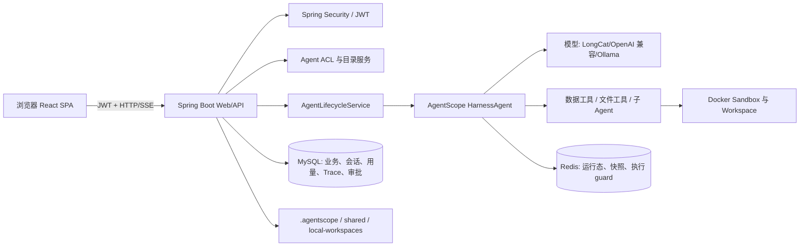

# 项目全景与架构

## 1. 一句话说明

AgentScope DataAgent 是一个面向数据分析场景的多用户 Agent 平台。用户可以创建或使用 Agent，通过自然语言发起数据分析任务；Agent 可调用受控的数据工具、在隔离工作区生成报告和图表、委派子 Agent，并把可复用能力提交到团队市场审批和版本化复用。

平台的价值不在于“接一个大模型”，而在于把大模型调用纳入身份、权限、状态、文件、成本和审计边界。

## 2. 业务对象与术语

| 名词 | 含义 | 主要事实来源 |
|---|---|---|
| 用户 | 登录主体，拥有个人 Agent、模型连接、用量和运行记录 | MySQL `user` 相关表 |
| 全局 Agent | 平台维护的共享 Agent，例如 `data-agent` | MySQL 配置/全局覆盖 + 共享工作区 |
| 私有 Agent | 用户自定义的 Agent；同名 Agent 在不同用户下必须隔离 | MySQL 定义 + `.agentscope/users/{userId}/agents/{agentId}` |
| 会话 | 一段可恢复的对话上下文，URL 中使用 `agent` 和 `session` 定位 | MySQL 会话元数据 + AgentScope state |
| 工作区 | `AGENTS.md`、skills、subagents、知识与产物的文件集合 | Workspace/Sandbox；本机镜像仅用于读取展示 |
| Sandbox | Agent 执行文件和命令的隔离环境，当前采用 Docker | AgentScope Sandbox 生命周期 + Redis snapshot（启用时） |
| Skill | 一组可加载的规则与资源文件，入口通常是 `SKILL.md` | 私有工作区/市场版本目录 |
| Contribution | 用户提交到团队市场、等待审核的能力资产 | MySQL 审批记录 + 文件快照 |
| Usage Event | 一次已完成聊天请求的聚合账本记录 | MySQL `usage_event` |
| Trace Run | 一次 Agent 请求的观测索引及其 OTel span | MySQL `trace_run`、`trace_span` |

## 3. 总体架构



### 3.1 请求主链路

```text
用户发送消息
  -> ChatController 校验 JWT、Agent ACL 和会话归属
  -> AgentLifecycleService 获取或懒构建 HarnessAgent
  -> AgentScope 执行模型、工具、子 Agent、Plan/Memory/Sandbox 策略
  -> 后端把事件转换为 SSE 推给 React
  -> 回合结束后记录会话、用量、Trace、工作区演化和偏好
  -> 前端刷新会话摘要、执行轨迹、用量/运行记录页面
```

这里的关键取舍是：**AgentScope 管 Agent 与 Sandbox 生命周期，应用层管产品规则**。应用没有再维护一套独立容器池；它在框架扩展点上接入用户身份、数据工具、审批、持久化和观测。

## 4. 技术栈

| 层 | 选型 | 作用 |
|---|---|---|
| 后端框架 | Java 17、Spring Boot 3.3.5、Spring MVC | REST、SSE、配置和生命周期 |
| Agent 框架 | AgentScope Java 2.0 `HarnessAgent` | Agent、工具、Workspace、Sandbox、状态、子 Agent |
| 安全 | Spring Security、JJWT | 登录、JWT 鉴权、管理员权限 |
| 关系库 | MySQL、Spring Data JPA | 用户、定义、会话、审批、用量、Trace、模型配置 |
| 运行态 | Redis（可选 profile） | AgentState、Sandbox snapshot、同隔离槽执行 guard |
| 沙箱 | Docker Desktop / Docker Sandbox | 文件与命令执行隔离 |
| 前端 | React 18、TypeScript、Vite、React Router | 聊天、配置、工作区、管理端 |
| 图表 | Vega Embed | 受限 Vega-Lite 图表渲染 |
| 可观测性 | OpenTelemetry SDK | Agent、模型、工具 span 的白名单持久化 |

## 5. 代码地图

### 5.1 后端分层

```text
src/main/java/io/agentscope/dataagent/
  security/        登录、JWT、用户与管理员接口
  agent/           Agent 目录、ACL、生命周期、工作区、Skill、子 Agent
  conversation/    聊天 SSE、会话、历史设置、用量账本
  tools/           数据源、SQL 预览、图表工具
  workspace/       Docker Sandbox、镜像、产物、状态失效
  capability/      偏好学习、贡献审批、Marketplace、模板
  model/           用户级模型连接、密钥加密、模型解析
  observability/   Trace Run/Span 持久化与查询
  integration/     Webhook、出站通道
  config/          Bootstrap、模型、状态、快照与 Web 配置
```

分层约定：`api` 负责 HTTP/DTO；`application` 编排业务规则；`infrastructure` 负责 JPA、文件、Redis、Docker 等具体适配。新代码应避免让 Controller 直接操作 Repository 或文件系统。

### 5.2 前端结构

```text
frontend/src/
  main.tsx                   路由、PrivateRoute、AdminRoute
  components/AppShell.tsx    聊天工作台壳、会话侧栏、统一滚动区
  components/InteractionHost.tsx
                              站内确认框与通知，不使用浏览器 confirm/alert
  pages/ChatPage.tsx         聊天与 SSE 事件展示
  pages/configure/           skills、subagents、tools、settings、channels、shares
  pages/admin/               运行实例、审批、用户、配置、调试等管理员页面
  pages/UsagePage.tsx        统一用量入口
  api/                       前端请求与鉴权头封装
```

## 6. 数据与状态边界

| 资源 | 事实来源 | 不应承担的职责 |
|---|---|---|
| MySQL | 用户、定义、授权、会话索引、审批、用量、Trace、模型连接 | 不直接存 Docker 临时状态 |
| Redis | AgentState、Sandbox snapshot、执行串行 guard | 不替代业务审计库 |
| Workspace | Agent 提示词、技能、子 Agent、长期文件与产物 | 不作为用户/审批关系查询库 |
| Docker Sandbox | 当前执行期的文件与命令环境 | 不作为最终业务存储 |
| `local-workspaces` | 本地只读镜像，便于前端浏览和故障降级 | 不能绕过 Sandbox 写入 |

### 6.1 私有工作区的目录规则

私有 Agent 的定义文件统一放在：

```text
.agentscope/users/{userId}/agents/{agentId}/
  AGENTS.md
  skills/
  subagents/
  knowledge/
  plans/
  artifacts/
  .dataagent/public-skills-v1
```

`userId` 与 `agentId` 都是路径段，会被校验。这样两个用户都创建 `personal-agent` 时，不会共享同一个 `skills/` 或 `subagents/` 目录。

## 7. 权限与隔离模型

1. **身份认证**：登录后持有 JWT；前端路由做体验层拦截，后端仍负责真实权限校验。
2. **Agent 权限**：全局 Agent、私有 Agent、分享/克隆/运行/编辑权限由 ACL 和所有者关系决定。
3. **数据隔离**：私有 Agent 的定义工作区按用户隔离；Sandbox 使用用户维度命名空间；个人用量与 Trace 按当前 JWT 用户查询。
4. **管理员权限**：平台汇总用量、用户管理、审批、运行实例与系统配置使用 `/api/admin/*` 并要求管理员角色。
5. **模型密钥**：用户模型 API Key 加密存储，只可写入，不在读取接口回显。

前端“管理员可以切换到平台用量”只是便利入口；真正的安全边界仍是后端 `/api/admin/usage/*` 的授权。

## 8. 给新维护者的阅读路线

建议不要从 185 个 Java 文件按目录顺序通读。按一次真实请求反向阅读更高效：

1. `frontend/src/pages/ChatPage.tsx`：看浏览器怎样连接 SSE、如何显示工具轨迹和人工确认。
2. `conversation/api/ChatController.java`：看请求如何进入 Agent、如何归档用量与 Trace。
3. `agent/application/AgentLifecycleService.java`：看私有 Agent 怎样被构建、缓存和注册到 Gateway。
4. `runtime/AgentRuntimeConfigurer.java`：看 Plan、Memory、Subagent、Permissions、Sandbox 等横切能力怎样统一装配。
5. `workspace/infrastructure/WorkspaceManagerFactory.java` 与 `RetryStartDockerSandbox.java`：看隔离槽、镜像与 Docker 兼容策略。
6. `conversation/application/UsageStore.java` 和 `observability/application/TraceRunService.java`：看请求如何变成可查询账本与运行记录。
7. `capability/contribution/application/MarketContributionService.java` 与 `agent/application/SkillInstallService.java`：看能力如何从个人工作区进入团队市场再安装回来。

## 9. 当前状态与非目标

已具备完整产品骨架：用户登录、Agent 管理、流式聊天、数据工具、HITL、工作区、技能/子 Agent、市场审批、模型连接、用量、Trace 与管理台。

当前不把以下事项宣传为已经完成的生产能力：

- 跨 MySQL、Redis、文件系统和 Docker 的强一致分布式事务；
- 真实多副本压测后的高可用与性能 SLA；
- 对 Skill Prompt Injection、危险命令、外部资源的完整供应链扫描；
- 完整离线评测集和自动化质量门禁；
- 通用任意 SQL 的形式化安全证明。
